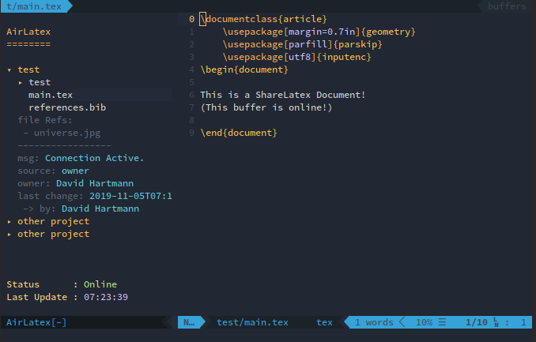

AirLatex.vim
============

**Note** This Work is currently in Progress. Please use it right now only for testing purposes.



Install
=======
1. Install the requirements. (python3)
    ```
    pip3 install browser_cookie3 tornado
    ```
2. Install the Vim Plugin itself
    Using **Vim Plug**:
    ```
	Plug 'da-h/AirLatex.vim', {'do': ':UpdateRemotePlugins'}

    " optional: set server name
    let g:airlatex_domain="www.sharelatex.com"
    ```
3. For the login, this plugin uses [`browser_cookie3](https://github.com/borisbabic/browser_cookie3). **Please use Firefox or Chrome to login.** Browser_cookie3 will find the right cookie for the server. :)
4. Open AirLatex in Vim with `:AirLatex`

Feel free to map AirLatex to a binding of your liking, e.g.:
```
nmap <leader>a :AirLatex<CR>
```

Credits
-------
This plugin is a complete rework of [Vim-ShareLaTeX-Plugin](https://www.github.com/thomashn/Vim-ShareLaTeX-Plugin).  
I took all the good ideas and added even more vim love ❥. ;)
